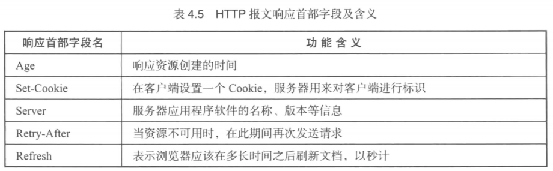

## 目录
```
### 第4 章 Laravel 框架中使用的HTTP 协议基础………………………………… 64
#### 4.1 HTTP 发展与相关网络技术……………………………………………………… 64
* 4.1.1 HTTP 发展 ………………………………………………………………………… 64
* 4.1.2 与HTTP 协议相关的网络技术 …………………………………………………… 65
#### 4.2 HTTP 协议简介…………………………………………………………………… 71
* 4.2.1 HTTP 协议工作流程 ……………………………………………………………… 71
* 4.2.2 请求报文和响应报文结构简介 …………………………………………………… 71
```


## 第4 章 Laravel 框架中使用的HTTP 协议基础………………………………… 64
### 4.1 HTTP 发展与相关网络技术……………………………………………………… 64
* 获取目标服务器地址用过统一资源定位符(Uniform Resource Locator, 即 __URL__)实现

* 相互间信息的传输通过超文本传输协议(HyperText Transfer Protocol, 即 __HTTP__)实现

* 而服务器返回内容的解析通过超文本标记语言(HyperText Markup Language, 即 __HTML__) 实现


#### 4.1.1 HTTP 发展 ………………………………………………………………………… 64
* 第一个版本: HTTP 协议诞生到标准的建立, 次本版统称为 HTTP/0.9 版本; (只支持 GET 方法, 只能接收 HTML 文本的相应)

* 第二个版本: 1996年5月正式公布的标准版本, 被命名为 HTTP/1.0 版本, 标准规范由 RFC1945 记录. (加入了 POST 等方法, HTTP 协议传输的内容扩展到图片 动画等格式)

* 第三个版本: 1997年1月公布的 HTTP/1.1 版本, 标准规范由 RFC2068 记录. (为了提升服务器性能, 增加了包括默认 __长连接__ 保持等功能)

* 目前大部分服务器都是用 HTTP/1.0 和 HTTP/1.1 版本, 目前正在发展的 HTTP/2.0 版本还需要时间普及.


#### 4.1.2 与HTTP 协议相关的网络技术 …………………………………………………… 65
* HTTP 协议是一种 __应用层协议__, 它的实现离不开其他的 __网络技术__, 与其关系密切的就有 TCP IP ARP DNS 等.

* 对于网络技术, 最常听到的就是 TCP/IP 协议, __实际上 TCP/IP 协议并不是指某种协议, 而是为了实现计算机通信的网络体系__.

* 很多网络体系, 例如 TCP/IP OSI IPX/SPX 等, 每一种网络体系中包含很多相应的协议, 被称为协议族

* 最长接触到的是 TCP/IP 网络体系 和 OSI 网络体系:
    * OSI 所定义的协议虽然没有得到普遍应用, 但是其设计的 OSI 参考模型经常被用户网络协议制定,
    * **TCP/IP** 已经成为全球范围共同遵循应用的一种通信协议标准, 该标准使得不同硬件和不同系统的网络设备可以行进互相通信

* 为了使复杂的网络协议变得简单化, 协议通常被 **分层** 处理, OSI 协议被分为 __七层__, 而 TCP/IP 协议被分为 __五层__
    * 在分层模式下, **每** 一层的实现都需要下一层提供特定的服务, 而本层实现的功能又为上一层提供服务

    * 层与层之间遵循 "接口" 的约定, 而两台机器之间遵循 "协议" 的约定

    * 每一层会将上一层传来的数据附加一个首部, 而加上首部的数据被送到下一层,
        * 下一层会将收到的数据包当成整个数据并加入本层的首部

        * 每一层首部至少都包含 _两部分信息_, 一部分是接收者和发送者的地址, 另一部分是上一层的协议类型

        * 对于接收者和发送者的地址, **数据链路层** 使用 MAC 地址, **网络层** 使用 IP地址, **传输层** 使用端口号

        * 结合协议分层模型可以得到 HTTP 协议在发送者和接收者间经过的分层处理, 如下图所示, 该结构也相当于 TCP/IP协议的模型结构

        * 

* TCP/IP 协议对于数据链路层没有进行 ... TODO: P67 起, 表示接下来的看不懂.


### 4.2 HTTP 协议简介…………………………………………………………………… 71
#### 4.2.1 HTTP 协议工作流程 ……………………………………………………………… 71
* 基于 HTTP 协议的请求 / 响应模式的信息交互过程可分为四个步骤:
    1. 客户端与服务端需要建立链接, 如 TCP 链接;

    2. 连接建立后, 客户端向服务端发送一个请求, 请求报文由三部分组成: 请求行, 消息报头, 请求内容;

    3. 服务器接到请求后, 解析该请求并返回响应信息, 响应报文由三部分组成: 状态行, 消息报头, 响应内容;

    4. 客户端接收服务器返回的信息并进行解析 处理 和 显示.

* 通常, 浏览器访问一个页面, 需要发出多次请求获取不同的响应内容
    * 在 HTTP/1.0 版本中默认是传输一次数据就关闭连接;

    * 而在 HTTP/1.1 版本中默认为 __持久连接__, 即一次 TCP 连接可以完成多次 HTTP 请求.

* 是否支持持久连接, 是由消息报头中的 `connection` 字段决定的, 如果请求或响应中的 `connection` 设置为 `close`, 则客户端和服务器的连接为非持久链接. 


#### 4.2.2 请求报文和响应报文结构简介 …………………………………………………… 71
* HTTP 协议的请求和响应数据包一般被称为请求报文和响应报文
    * 根据协议标准, 请求报文和响应报文是由 报文首部 空行 和 报文主体 组成的;
    * 而请求 报文首部 又由 请求行 请求首部字段 通用首部字段 实体首部字段 组成;

* 根据以上结构, 可以讲 HTTP 协议报文包含的内容分为五类:
    1. 请求行: 由请求方法 请求URL HTTP版本组成;
    2. 状态行: 由 HTTP版本 状态吗 原因短语组成;
    3. 首部字段: 包含了请求首部 响应首部 通用首部 实体首部四种类型, 一般由名字和值组成;
    4. 其他报文首部字段: 包含了一些 RFC 中未定义的首部内容;
    5. 报文主体: 由任意数据组成.

* 

* 

* 

##### 1.**请求行**
* 请求行中的请求方法用来描述服务器执行的操作, 而请求 URL 指定了操作的资源, HTTP 版本用来表示客户端使用的 HTTP 版本

* 

##### 2.**状态行**
* 状态行包含响应报文服务器使用的 HTTP 版本 数字状态码 和原因短语

* HTTP 的状态码共分为五大类 (几十种), 用户描述返回的响应结果

* 

* 


##### 3.**首部字段**
* 首部字段是构成 HTTP 报文的基本要素之一, 可以分为四类:
    * 通用首部字段 请求首部字段 响应首部字段 实体首部字段
    
    * 首部字段通常由字段名和字段值构成, 中间通过 `:` 分隔

* 1.通用首部字段
    * 无论是请求报文还是响应报文都可以使用

    * 

* 2.请求首部字段
    * 主要描述客户端的版本 处理能力等信息, 用于帮助服务器更好的提供求情响应字段

    * 如告诉服务器值接收某种响应内容的 Accept 字段, 发送 Cookies 的 Cookie 字段等

    * 

* 3.响应首部字段
    * 主要用于描述主机信息 功能等, 有助于客户端处理响应, 并在将来发出更适合服务器的请求

    * 例如定时刷新的 Refresh 头, 设置 Cookie 的 Set-Cookie 头等

    * 

* 4.实体首部字段
    * 用于描述 HTTP 报文数据的字段

    * 用于描述主体内容的元信息, 包括实体信息类型 长度 压缩方法 最后一次修改时间 数据有效性, 以便告诉接收者如何机型处理, 如 Content-Language 用来描述报文主体的语言等

    * 
