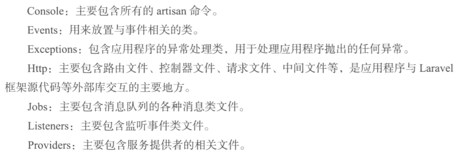
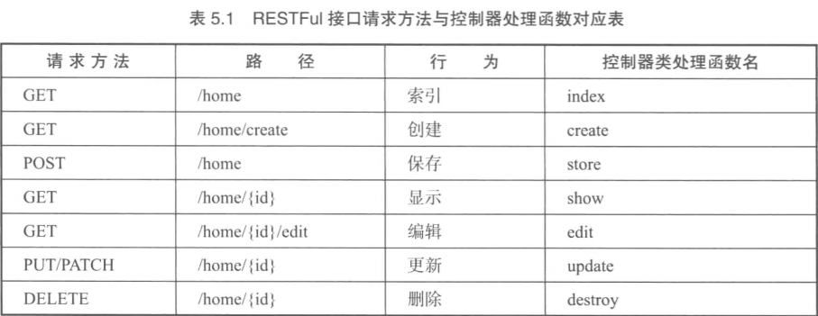

## 目录
```
### 第5 章 Laravel 框架初识………………………………………………………… 77
#### 5.1 Laravel 框架应用程序目录结构………………………………………………… 77
* 5.1.1 Laravel 框架应用程序根目录介绍 ………………………………………………… 77
* 5.1.2 app 目录介绍 ……………………………………………………………………… 78
* 5.1.3 vendor 目录介绍 …………………………………………………………………… 78
#### 5.2 Laravel 框架应用程序的三个重要环节………………………………………… 79
* 5.2.1 路由 ………………………………………………………………………………… 79
* 5.2.2 控制器 ……………………………………………………………………………… 82
* 5.2.3 视图 ………………………………………………………………………………… 86
```


## 第5 章 Laravel 框架初识………………………………………………………… 77
* 路由 控制器 视图

### 5.1 Laravel 框架应用程序目录结构………………………………………………… 77
* Laravel 框架按照 PSR-0 和 PSR-4 规范组织文件的目录结构
    * 通过这种规范的结构, 可以更好的实现文件的自动加载和分类

* 想要自己自由组织框架结构, 需要使用 Composer 实现自动加载

#### 5.1.1 Laravel 框架应用程序根目录介绍 ………………………………………………… 77
* app: 应用的核心代码, 大部分工作都在这个目录下, 包含 路由文件 控制器文件 模型文件

* bootstrap: 包含几个框架启动和自动加载配置的文件

* config: 应用常用配置文件信息

* database: 包含数据库迁移和数据填充文件

* public: 应用的入口目录, 入口文件 index.php, 以及静态资源文件如 CSS JS images 等

* resources: 视图文件

* storage: 编译后的Blade模板, 基于文件的session, 文件缓存, 日志文件等

* tests: 自动化测试文件

* vendor: 依赖库文件, 其中包括 laravel 框架的源代码

* .env: laravel 框架主要配置文件

* composer.json: composer 项目依赖管理文件


#### 5.1.2 app 目录介绍 ……………………………………………………………………… 78
* 该目录通过 composer 使用自动加载标准(PSR-4)来自动加载其中的文件

* 想改变这个目录的命名空间可以通过 `php artisan app:name` 完成, 也可以直接修改 composer.json 来实现

* 

#### 5.1.3 vendor 目录介绍 …………………………………………………………………… 78
* 项目的所有依赖文件

### 5.2 Laravel 框架应用程序的三个重要环节………………………………………… 79
#### 5.2.1 路由 ………………………………………………………………………………… 79
* 路由参数

* 路由命名 (别名)

* 路由群组

#### 5.2.2 控制器 ……………………………………………………………………………… 82
* 控制器路由

* 隐式控制器路由

* RESTFul 资源控制器路由
    * 

#### 5.2.3 视图 ………………………………………………………………………………… 86
* 传递数据

* blade 模板: 详见手册
