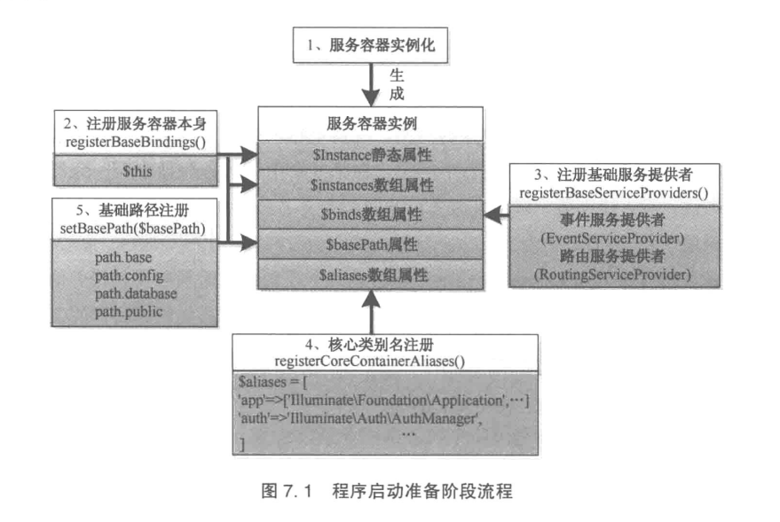

## 目录
```
## 第7 章 请求到响应的生命周期… ……………………………………………… 114
### 7.1 程序启动准备… ………………………………………………………………… 114
* 7.1.1 服务容器实例化 …………………………………………………………………… 115
* 7.1.2 核心类（Kernel 类）实例化 ……………………………………………………… 120
### 7.2 请求实例化… …………………………………………………………………… 121
### 7.3 处理请求… ……………………………………………………………………… 124
* 7.3.1 请求处理准备工作 ………………………………………………………………… 125
* 7.3.2 中间件 ……………………………………………………………………………… 137
* 7.3.3 路由处理生成响应 ………………………………………………………………… 140
* 7.4 响应的发送与程序终止… ……………………………………………………… 146
* 7.4.1 响应的发送 ………………………………………………………………………… 146
* 7.4.2 程序终止 …………………………………………………………………………… 148
```


## 第7 章 请求到响应的生命周期… ……………………………………………… 114
### 7.1 程序启动准备… ………………………………………………………………… 114
* 入口文件 `public\index.php`

* 


#### 7.1.1 服务容器实例化 …………………………………………………………………… 115
* `bootstrap/app.php`
    * 注册基础绑定
    * 注册基础服务提供者
    * 注册核心类别名和应用的基础路径


#### 7.1.2 核心类（Kernel 类）实例化 ……………………………………………………… 120
* `vendor/laravel/framework/src/Illuminate/Foundation/Http/Kernel.php`


### 7.2 请求实例化… …………………………………………………………………… 121
* `vendor/laravel/framework/src/Illuminate/Http/Request.php`

### 7.3 处理请求… ……………………………………………………………………… 124
* `vendor/laravel/framework/src/Illuminate/Foundation/Http/Kernel.php`

#### 7.3.1 请求处理准备工作 ………………………………………………………………… 125
* `vendor/laravel/framework/src/Illuminate/Foundation/Http/Kernel.php`
    * 环境检测与配置加载
    * 外观注册
    * 服务提供者注册
    * 启动服务

#### 7.3.2 中间件 ……………………………………………………………………………… 137
* `protected function sendRequestThroughRouter($request)`


#### 7.3.3 路由处理生成响应 ………………………………………………………………… 140
1. 路由匹配
2. 控制器生成
3. 响应生成


#### 7.4 响应的发送与程序终止… ……………………………………………………… 146

#### 7.4.1 响应的发送 ………………………………………………………………………… 146

#### 7.4.2 程序终止 …………………………………………………………………………… 148
