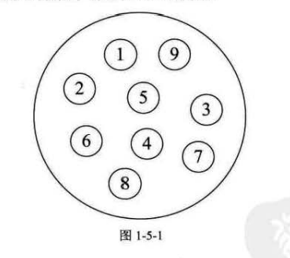
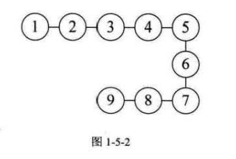
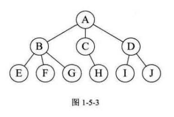
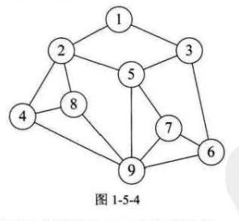
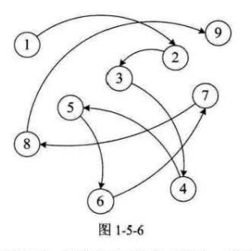

## 第1章数据结构绪论

### 1.1开场白 2

### 1.2你数据结构怎么学的？ 3

### 1.3数据结构起源 4
* 在计算机科学中， __数据结构__（英语：data structure）是计算机中存储、组织数据的方式。
    * 数据结构是指相互之间存在一种或多种特定关系的数据元素的集合。
    * 通常情况下，精心选择的数据结构可以带来更高的运行或者存储效率。
    * 数据结构往往同高效的检索算法和索引技术有关。

* 程序设计 = 数据结构 + 算法

### 1.4基本概念和术语 5
#### 1.4.1数据 5
* __数据__：是描述客观事务的符号，是计算机中可以操作的对象，是能被计算机识别，并输入给计算机处理的符号集合。
    * 数据不仅仅包括整型 实型等数值类型，还包括字符串及声音 图像 视频等非数值类型。

#### 1.4.2数据元素 5
* __数据元素__：是组成数据的、有一定意义的基本单位，在计算机中通常作为整体处理，也被称为 __记录__。

#### 1.4.3数据项 6
* __数据项__：一个数据元素可以由若干个数据项组成。数据项是数据 _不可分隔的最小单位_。

#### 1.4.4数据对象 6
* __数据对象__：是性质相同的数据元素的集合，是数据的子集。性质相同是指数据元素具有相同数量和类型的数据项。

#### 1.4.5数据结构 6
* __数据结构__：是相互之间存在一种或多种特定关系的数据元素的集合。

### 1.5逻辑结构与物理结构 7
#### 1.5.1逻辑结构 7
* 逻辑结构：是指数据对象中数据元素之间的相互关系。逻辑结构分为以下四种：
    * 1. __集合机构__：集合结构中的数据元素除了同属于一个集合外，它们之间没有其他关系。
        * 

    * 2. __线性结构__：线性结构中的数据元素之间是 __一对一__ 的关系。
        * 
        
    * 3. __树形结构__：树形结构中的数据元素之间存在 __一种一对多__ 的层次关系。
        * 

    * 4. __图形结构__：图形结构的数据元素是 __多对多__ 的关系。
        * 

#### 1.5.2物理结构 9
* 物理结构：是指数据的逻辑结构在计算机中的存储形式。
    * 1. 顺序存储结构：是把数据元素存放在 _地址连续的存储单元_ 里，其数据间的逻辑关系和物理关系是一致的。

    * 2. 链式存储结构：是把数据元素存放在任意的存储单元里，这组存储单元可以是连续的，也可以是不连续的。其数据元素的存储关系并不能反映其逻辑关系。
        * 因此需要用一个 __指针__ 存放数据元素的地址，这样通过地址可以找到相关联数据元素的位置

        * 

### 1.6抽象数据类型 11
####  1.6.1数据类型 11
* __数据类型__：是指一组性质相同的值的集合及定义在此集合上的一些操作的总称。
    * 原子类型： 不可再分解的基本类型，比如整型 实型 字符型等
    * 结构类型： 若干个类型组合，可以在分解，如整型数组是由若干个整型数据组成

####  1.6.2抽象数据类型 12
* _抽象_ 是指抽取出食物具有普遍性的本质。
    * 抽出像的部分

* __抽象数据类型__：`Abstract Data Type，ADT`，是指一个数学模型及定义在该模型上的一组操作。
    * 可以是各种数据类型的组合, 同来表示特定的意义。例如用来表示一个坐标 表示一个人的数据类型。结构体？ 对象？

### 1.7总结回顾 14

### 1.8结尾语 15

