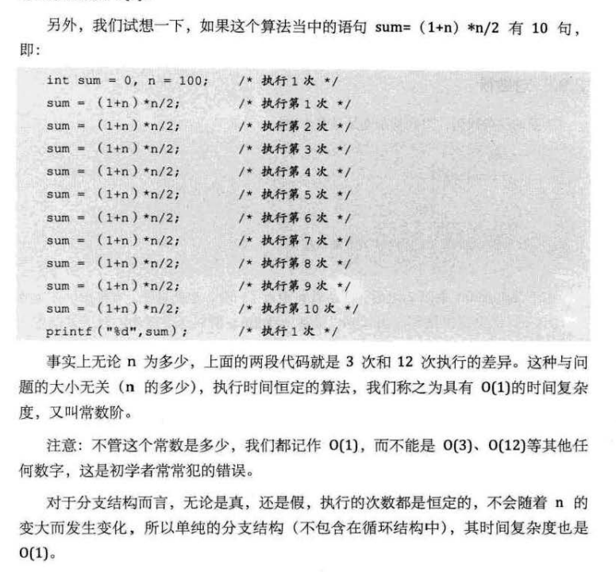
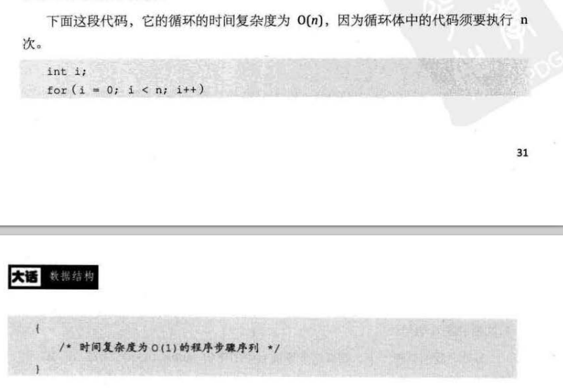
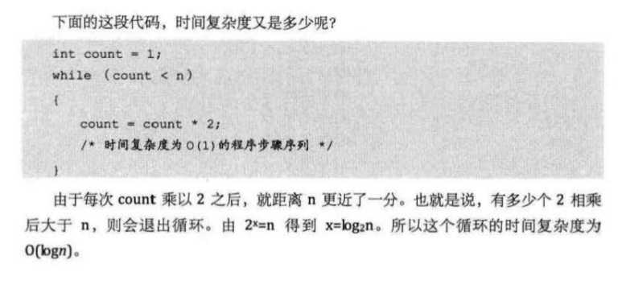
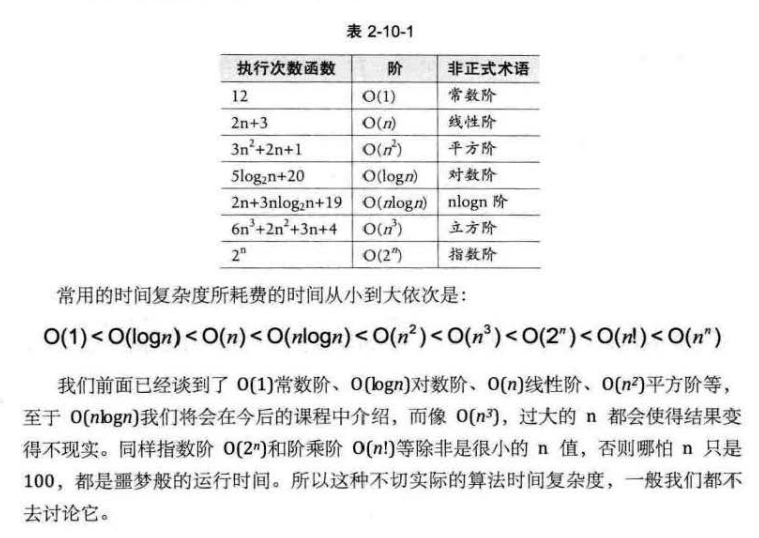

## 第2章算法 17

### 2.1开场白 18

### 2.2数据结构与算法关系 18

### 2.3两种算法的比较 19
* 经典案例， 高斯计算 1+2+...+100的结果

### 2.4算法定义 20
* __算法__ 是解决特定问题求解步骤的描述，在计算机中表现为指令的有限序列，并且每条指令表示一个或多个操作。

### 2.5算法的特性 21
* 输入， 输出， 有穷性， 确定性， 可行性。

#### 2.5.1输入输出 21
* 算法具有零个或多个 __输入__， 至少一个或多个 __输出__

#### 2.5.2有穷性 21
* 算法在执行有限的步骤之后，自动结束而不会无限循环，并且每个步骤在可接受的时间内完成。

#### 2.5.3确定性 21
* 算法的每一步骤都具有明确的含义，不会出现二义性。

#### 2.5.4可行性 21
* 算法的每一步都必须是可行的，也就是说，每一步都能通过执行有限次数完成。

### 2.6算法设计的要求 22
* 正确性， 可读性， 健壮性， 高效率， 存储低

#### 2.6.1正确性 22

#### 2.6.2可读性 23

#### 2.6.3健壮性 23

#### 2.6.4时间效率高和存储量低 23

### 2.7算法效率的度量方法 24
#### 2.7.1事后统计方法 24

#### 2.7.2事前分析估算方法 25

### 2.8函数的渐近增长 27
* __函数的渐近增长__： 给定两个函数 `f(n)` 和 `g(n)`，如果存在一个整数 `N`，使得对于所有的 `n > N`，`f(n)`总是比 `g(n)` 大，那么，我们说 `f(n)` 的渐近增长快于 `g(n)`。
    * 例如：`f(n) = 2n^2+1，g(n) = 2n+1`, 当 `n=1` 是 `f(n) = g(n)`，这个时候对应上面的概念，`N=1`，当 `n>N`，也就是当 `n>1` 时，`f(n) > g(n)`，所以，我们说 `f(n)` 的 __渐近增长__ 快于`g(n)`, 同理，我们可以观察 `2n` 与 `2n^2`

* 判断一个算法的效率，函数中的常量和其他次要项常常是可以忽略的，更应该关注主项（最高阶项）的阶数。

* 某个算法，随着 n 的增大，它会越来越优于另一个算法，或者越来越差与另一个算法。
    * 通过 __算法时间复杂度__ 来估算算法的 __时间效率__

### 2.9算法时间复杂度 29
#### 2.9.1算法时间复杂度定义 29
* 在进行算法分析时，语句总的执行次数 `T(n)` 是关于问题规模 n 的函数，进而分析 `T(n)` 随n的变化情况并确定 `T(n)` 的数量级。__算法的时间复杂度，也就是算法的时间量度。记作：`T(n) = O(f(n))`。它表示随问题n的增大，算法执行时间的增长率和 `f(n)` 的增长率相同，称作算法的渐进时间复杂度，简称为时间复杂度__。其中，f(n)是问题规模n的某个函数。

* 这样用大写 `O()` 来体现算法时间复杂度的记法，我们称之为 __大0记法__。

* 一般情况下，随着 n 的增大，`T(n)` 增长最慢的算法为最优算法。

#### 2.9.2推导大o阶方法 30
* 1. 用常数1来取代运行时间中所有加法常数；
* 2. 修改后的函数中，只保留最高阶项；
* 3. 如果最高阶项存在且不是1，则去除与这个项相乘的常熟。

#### 2.9.3常数阶 30
* `O(1)`

* eg: 

#### 2.9.4线性阶 31
* `O(n)`

* 分析算法的复杂度，关键是要分析循环结构的运行情况。

* eg: 

#### 2.9.5对数阶 32
* `O(logn)`

* eg: 

#### 2.9.6平方阶 32

#### 2.10常见的时间复杂度 35
* eg: 

#### 2.11最坏情况与平均情况 35

#### 2.12算法空间复杂度 36

#### 2.13总结回顾 37

#### 2.14结尾语 38
