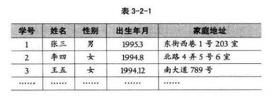
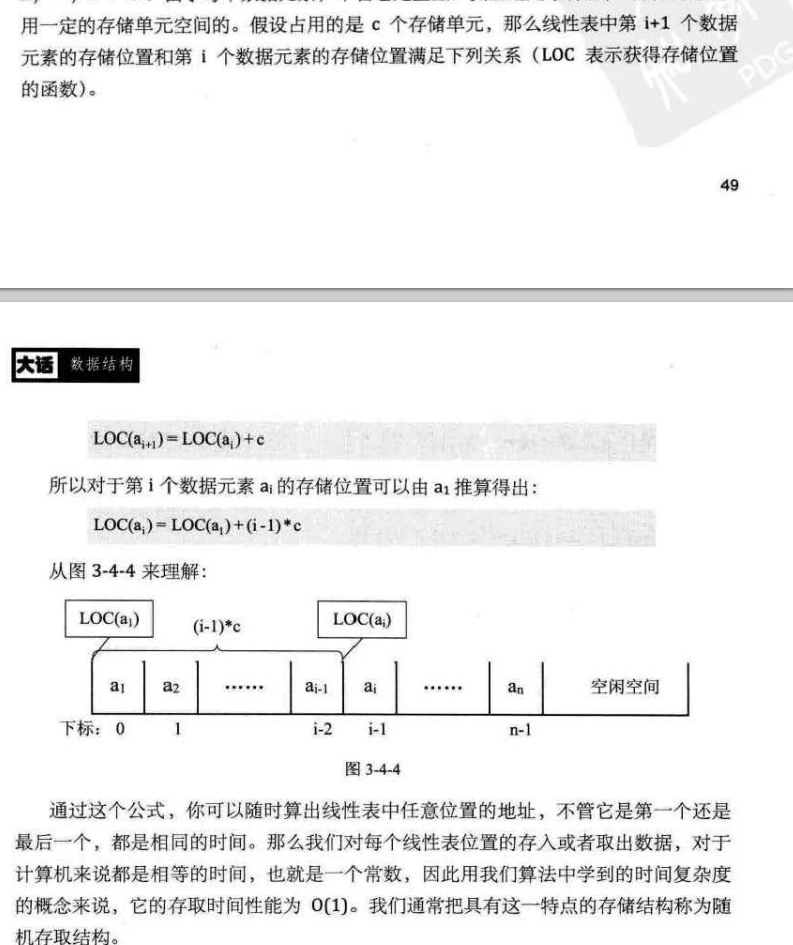
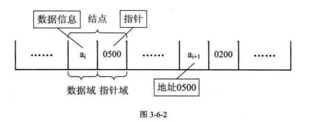
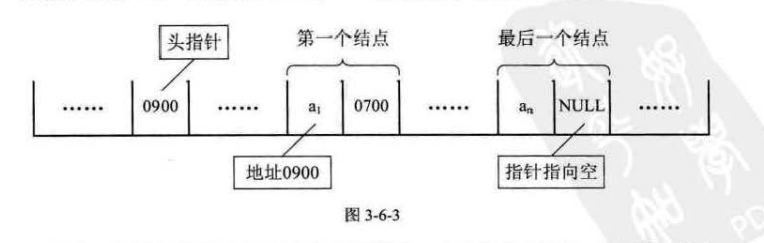
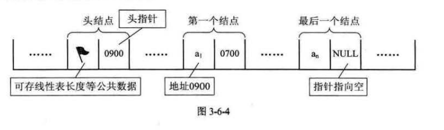
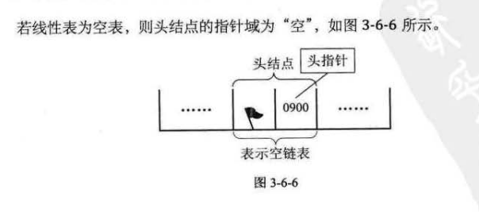
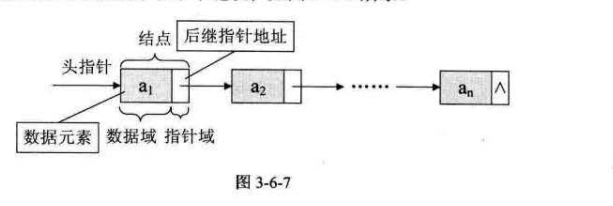

## 第3章线性表

### 3.1开场白 42

### 3.2线性表的定义 42
* __线性表（List）__： 零个或多个 _数据元素_ 的有限序列。

* 在较复杂的线性表中，一个 _数据元素_ 可以由若干个 _数据项_ 组成。
    * 

### 3.3线性表的抽象数据类型 45
```
ADT 线性表(List)


Data
    线性表的数据对象集合为 {a1, a2..,an}, 每个元素的类型均为 DataType。

    其中，除第一个元素 a1 外，每一个元素有且只有一个 _直接前驱元素_，除了最后一个元素 an 外，每一个元素有且只有一个 _直接后继元素_。
    
    数据元素之间的关系是 __一对一__ 的关系。


Operation:
    InitList(*L); // 初始化操作，建立一个空的线性表 L。

    ListEmpty(L); // 判断线性表是否为空表，若线性表为空，返回 true,否则返回 false。

    ClearList(*L); // 将线性表清空。

    GetElem(L,i,*e); // 将线性表 L 中的第 i 个位置元素值返回给 e。

    LocateElem(L,e); // 在线性表 L 中查找与给定值 e 相等的元素，如果查找成功，返回该元素在表中序号表示成功; 否则，返回 0 表示失败。

    ListInsert(*L, i, e); // 在线性表L中的第i个位置插入新元素e。

    ListDelete(*L, i, *e); // 删除线性表L中第i个位置元素，并用e返回其值。

    ListLength(L); // 返回线性表L的元素个数。
```

### 3.4线性表的顺序存储结构 47
#### 3.4.1顺序存储定义 47
* __线性表的顺序存储结构__，指的是用一段 __地址连续__ 的存储单元依次存储线性表的数据元素。

#### 3.4.2顺序存储方式 47
* （一般开发语言， 例如 C语言）用 __一维数组__ 来实现顺序存储结构

#### 3.4.3数据长度与线性表长度区别 48

#### 3.4.4地址计算方法 49
* 

* 存储器中的每个存储单元都有自己的编号，这个编号成为 __地址__。

* 


### 3.5顺序存储结构的插入与删除 50
#### 3.5.1获得元素操作 50


#### 3.5.2插入操作 51
* 插入算法的思路：
    1. 如果插入位置不合适，抛出异常；
    2. 如果线性表长度大于等于数组长度，则抛出异常或动态增加容量；
    3. 从最后一个元素开始向前遍历到第 i 个位置，分别将他们都向后移动一个位置；
    4. 将要插入元素填入位置 i 处；
    5. 表长加 1.

#### 3.5.3删除操作 52
* 删除算法思路:
    1. 如果删除位置不合理，抛出异常；
    2. 取出删除元素；
    3. 从删除元素位置开始遍历到最后一个元素位置，分别将他们都向前移动一个位置；
    4. 表长减一。

#### 3.5.4线性表顺序存储结构的优缺点 54
* 经过上面分析，我们可以知道：
    * 线性表的顺序存储结构在存、读数据时，不管是哪个位置，时间复杂度都是 `O(1)`; 
    * 而插入或删除时，时间复杂度都是 `O(n)`。

* 优点：无须为表示表中元素之间的逻辑关系而增加额外的存储空间；可以快速地存取表中任意位置的元素。

* 缺点：插入和删除操作需要移动大量元素；当线性表长度变化大时，难以确定存储空间的容量；造成成存储空间的碎片。


### 3.6线性表的链式存储结构 55
#### 3.6.1顺序存储结构不足的解决办法 55


#### 3.6.2线性表链式存储结构定义 56
* 为了表示每个数据元素 ai 与其直接后继数据元素 `ai+1` 之间的逻辑关系，对数据元素 ai 来说，除了存储其本身的信息之外，还需存储一个指示其直接后继的信息(即直接后继的存储位置)。
    * 数据域：我们把存储数据元素信息的域称为数据域。
    * 指针域：存储直接后继位置的域称为指针域。
    * 指针/链：指针域中存储的信息称做指针或链。
    * 结点(Node)：数据域与指针域这两部分信息组成数据元素ai的存储映像，称为结点(Node)。

* 

* 

* 链表中第一个结点的存储位置叫做 __头指针__

* 在单链表的第一个节点前附设一个节点，称为 __头结点__

* 

#### 3.6.3头指针与头结点的异同 58
* 头指针:
    1. 头指针是指链表指向第一个结点的指针，若链表有头结点，则是指向头结点的指针、
    2. 头指针具有标识作用，所以常用头指针冠以链表的名字
    3. 无论链表是否为空，头指针均不为空。头指针是链表的必要元素 

* 头结点:
    1. 头结点是为了操作的统一和方便而设立的，放在第一个元素的结点之前，其数据域一般无意义（也可存放链表的长度）
    2. 有了头结点，对第一元素结点前插入结点和删除第一结点，其操作与其他结点的操作就统一了
    3. 头结点不一定是链表必须要素

#### 3.6.4线性表链式存储结构代码描述 58
* 

* 

### 3.7单链表的读取 60
### 3.8单链表的插入与删除 61
#### 3.8.1单链表的插入 61


#### 3.8.2单链表的删除 64


### 3.9单链表的整表创建 66
### 3.10单链表的整表删除 69
### 3.11单链表结构与顺序存储结构优缺点 70
### 3.12静态链表 71
#### 3.12.1静态链表的插入操作 73


#### 3.12.2静态链表的删除操作 75


#### 3.12.3静态链表优缺点 77


### 3.13循环链表 78
### 3.14双向链表 81
### 3.15总结回顾 84
### 3.16结尾语 85