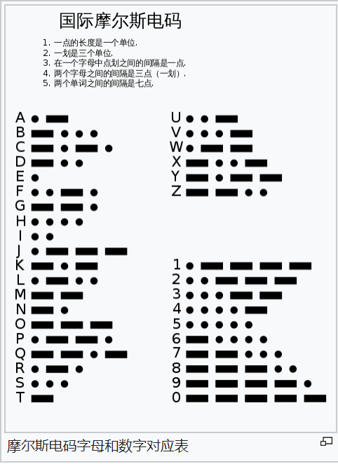
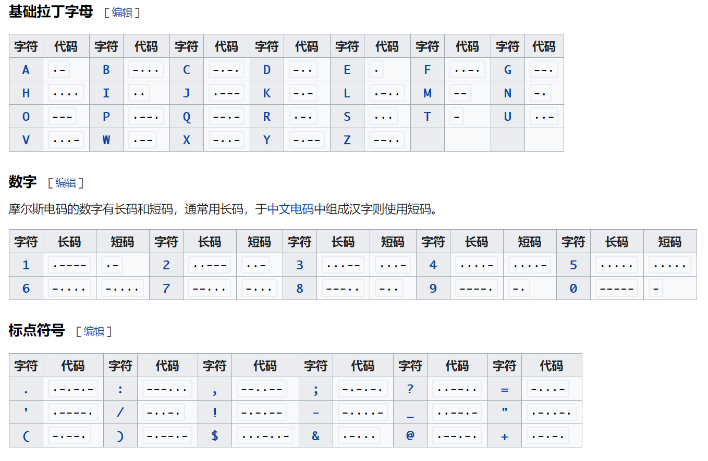
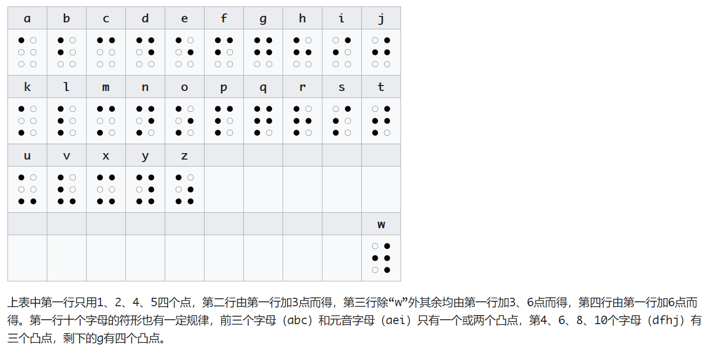
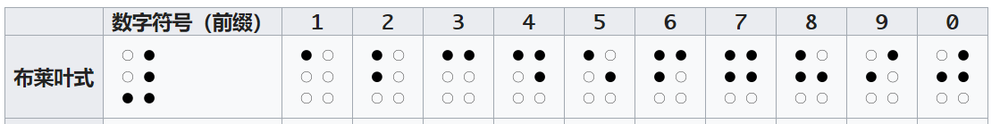

### 莫尔斯电码
* 当使用手电筒 亮灭 次数来表示字母很麻烦事

* __莫尔斯电码__ 使用 "点(dot)" 和 "划(dash)" 表示编码
    * 通俗点理解就是手电筒 短按 和 长按 的效果.

* 

* 

* 在莫尔斯编码中, "点" 和 "划" 之间的 _停顿_ 是至关重要的.
    * 对于同一个单词中的字母, 则通过较长的停顿来分隔.

* 简单且短促的编码, 被分配给字母表中 _使用频率_ 较高的字母 (如 E T)
    * 不常用的字母则分配较长的编码 (如 Q Z)

* 虽然莫尔斯电码和计算机毫无关系, 但是, 熟悉 __编码的本质__ 对于深入理解计算机软硬件内部结构以及隐匿在其后的语言将大有好处.

* 本书中, __编码__ 这个词的意思事指一种用来在机器和人之间传递信息的方式.
    * 换句话说, 编码就是交流

* 莫尔斯编码的一个缺点: 无法区分大写字母和小写字母

* 几乎每个人都知道一点儿莫尔斯编码: 三个点 三个划 再加三个点 表示 __SOS__.
    * 国际求救信号, SOS 不是一个缩写, 只是一个 _易于记忆_ 的莫尔斯编码序列

### 布莱叶盲文
* 这种文字使用一系列 _凸起的点_ 来代表字母 字符串 以及 整个单词.

* 

* 
